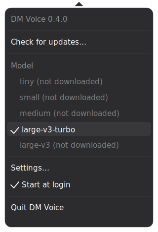
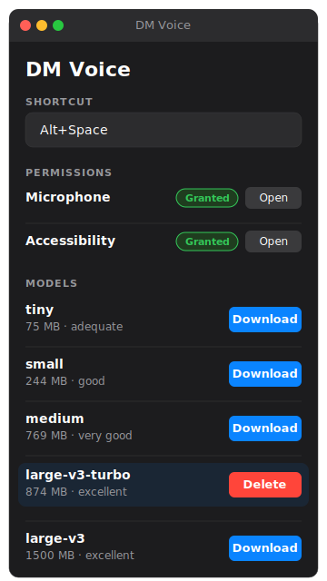

# DM Voice

Push-to-Talk Speech-to-Text app for macOS. Hold the hotkey → speak → release → text gets injected into the currently active text field. Local, offline, powered by Whisper.



## Interface

| Tray menu | Settings |
|:---:|:---:|
|  |  |

> These mockups mirror the actual UI in structure and behavior. Minor visual differences from the real app may stem from the macOS renderer and the user's accent color choice.

## Features

- **Push-to-talk** with a freely configurable hotkey (default: `Alt+Space`)
- **Whisper models** to choose from (tiny / small / medium / large-v3-turbo / large-v3) — switchable directly from the tray menu
- **Local & offline** — no cloud upload, runs with Metal acceleration on Apple Silicon
- **Text injection** into any active app via Cmd+V (CGEvent + AX API)
- **Launch at login** as a tray-menu toggle
- **Recording limit**: 60 seconds per push-to-talk

## Installation

1. **Download**: grab the latest DMG from [Releases](https://github.com/m0nji/DM_Voice/releases)
2. **Open the DMG** and drag `DM Voice.app` into `/Applications`
3. **First launch**: right-click the app → "Open" → confirm "Open" in the dialog
   *(The app is not notarized by Apple, so macOS shows the Gatekeeper warning once. Double-click works from the second launch onward.)*
4. **Grant permissions** on first run:
   - **Microphone** — to capture audio
   - **Accessibility** — to inject text via Cmd+V

On first launch the `large-v3-turbo` model (~874 MB) is downloaded automatically. Other models can be fetched afterward from the tray menu.

## Usage

- **Recording**: hold the hotkey (default `Alt+Space`), speak, release → text is inserted into the active field
- **Click the tray icon**: opens the menu with model picker, autostart toggle, settings, quit
- **Settings** → change hotkey, check permissions, download/delete models

## Building from source

Prerequisites: macOS 13+, Rust toolchain, Tauri CLI (`cargo install tauri-cli`).

```bash
git clone https://github.com/m0nji/DM_Voice.git
cd DM_Voice/src-tauri
cargo tauri build --bundles app,dmg
```

The resulting bundle is at `src-tauri/target/release/bundle/macos/DM Voice.app`,
the DMG at `src-tauri/target/release/bundle/dmg/`.

**Important**: If you sign the build yourself, omit the hardened-runtime flag
(`codesign` without `--options runtime`) — otherwise macOS silently suppresses
the microphone TCC prompt for locally self-signed certs.

## License

DM Voice is licensed under the **GNU General Public License v3.0 or later** (GPL-3.0+).
See [LICENSE](LICENSE) for the full text.

In short:
- You may use, modify and redistribute the app — including commercially.
- If you redistribute a modified version, you must also publish its complete
  source code under the same (or a compatible later) GPL license.
  Closed-source forks are not permitted.
- No warranty, no liability — see LICENSE sections 15 and 16.

© 2026 DM Apps.

---

<p align="center">
  <a href="https://www.buymeacoffee.com/m0nji" target="_blank">
    
  </a>
  &nbsp;&nbsp;
  <a href="https://www.paypal.com/pool/9p2cITSKXm?sr=wccr" target="_blank">
    
  </a>
</p>
